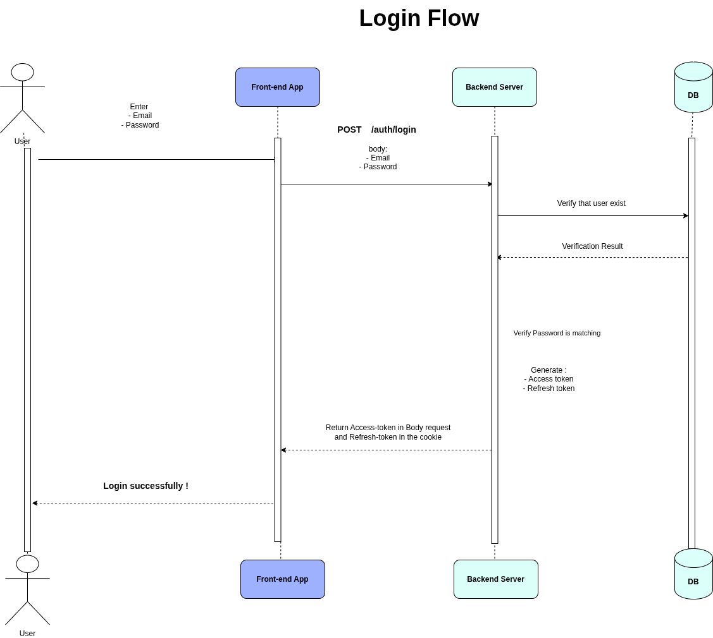
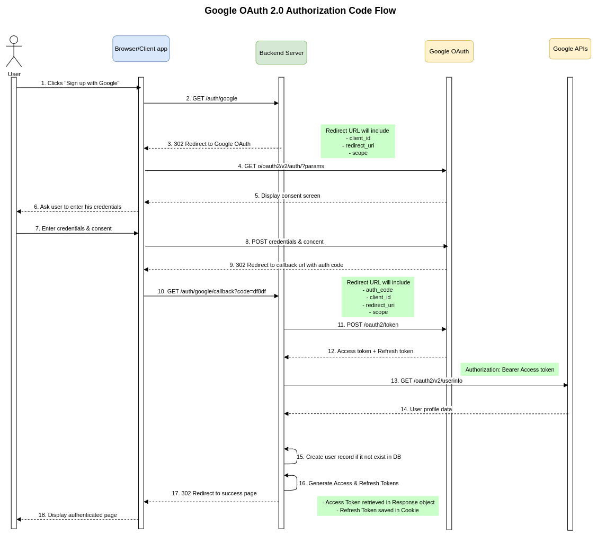

# NestJS Authentication API

A robust authentication system built with NestJS, featuring multiple authentication strategies including local login and Google OAuth integration.

## Features

- **User Registration & Login** - Traditional email/password authentication
- **JWT Authentication** - Access and refresh token implementation
- **Google OAuth** - Social login integration
- **Secure Cookies** - HTTP-only cookies for refresh tokens
- **MongoDB Integration** - User data persistence
- **Password Hashing** - Secure bcrypt encryption
- **Input Validation** - Request validation with class-validator

## Authentication Flow

This application supports two main authentication flows:

### Local Login Flow



The traditional email/password authentication process includes user registration, login with credentials validation, and JWT token generation.

### Google OAuth Flow



The Google OAuth integration allows users to authenticate using their Google accounts through the OAuth 2.0 protocol.

## Quick Start

### Prerequisites

- Node.js (v16 or higher)
- Docker & Docker Compose
- MongoDB (or use the provided Docker setup)

### Installation

1. **Clone the repository**

   ```bash
   git clone https://github.com/MohamedAboElnaser/nest-auth.git
   cd nest-auth
   ```

2. **Install dependencies**

   ```bash
   npm install
   ```

3. **Environment Setup**

   _Copy the provided `.env.example` file to your project's root directory and rename it to `.env`. Then, fill in the required values for your environment variables:_

   ```bash
   cp .env.example .env
   ```

4. **Start MongoDB with Docker**

   ```bash
   docker-compose up -d
   ```

5. **Run the application**

   ```bash
   # Development mode
   npm run start:dev

   # Production mode
   npm run start:prod
   ```

## API Endpoints

### Authentication

| Method | Endpoint                | Description               |
| ------ | ----------------------- | ------------------------- |
| POST   | `/auth/register`        | Register new user         |
| POST   | `/auth/login`           | Login with email/password |
| POST   | `/auth/refresh`         | Refresh access token      |
| GET    | `/auth/google`          | Initiate Google OAuth     |
| GET    | `/auth/google/callback` | Google OAuth callback     |

### Users

| Method | Endpoint    | Description                       |
| ------ | ----------- | --------------------------------- |
| GET    | `/users/me` | Get current user data (protected) |

### General

| Method | Endpoint              | Description             |
| ------ | --------------------- | ----------------------- |
| GET    | `/`                   | Health check            |
| GET    | `/protected-resource` | Test protected endpoint |

## Usage Examples

### Register a new user

```bash
curl -X POST http://localhost:4000/auth/register \
  -H "Content-Type: application/json" \
  -d '{
    "name": "John Doe",
    "email": "john@example.com",
    "password": "password123"
  }'
```

### Login

```bash
curl -X POST http://localhost:4000/auth/login \
  -H "Content-Type: application/json" \
  -d '{
    "email": "john@example.com",
    "password": "password123"
  }'
```

### Access protected endpoint

```bash
curl -X GET http://localhost:4000/users/me \
  -H "Authorization: Bearer YOUR_ACCESS_TOKEN"
```

## Google OAuth Setup

1. Go to [Google Cloud Console](https://console.cloud.google.com/)
2. Create a new project or select existing one
3. Enable Google+ API
4. Create OAuth 2.0 credentials
5. Add authorized redirect URI: `http://localhost:4000/auth/google/callback`
6. Copy Client ID and Client Secret to your `.env` file

## Database Management

Access MongoDB through the web interface:

- **Mongo Express**: http://localhost:8081
- **Username**: admin
- **Password**: password

## Scripts

```bash
# Development
npm run start:dev          # Start with hot reload
npm run start:debug        # Start in debug mode

# Production
npm run build              # Build the application
npm run start:prod         # Start production server

# Testing
npm run test               # Run unit tests
npm run test:e2e           # Run end-to-end tests
npm run test:cov           # Run tests with coverage

# Code Quality
npm run lint               # Run ESLint
npm run format             # Format code with Prettier
```

## Project Structure

```
src/
├── auth/                  # Authentication module
│   ├── strategies/        # Passport strategies
│   ├── guards/           # Auth guards
│   └── dtos/             # Data transfer objects
├── user/                 # User module
│   ├── schemas/          # MongoDB schemas
│   └── interfaces/       # TypeScript interfaces
└── main.ts               # Application entry point
```

## Tech Stack

- **Framework**: NestJS
- **Database**: MongoDB with Mongoose
- **Authentication**: Passport.js (Local, JWT, Google OAuth)
- **Validation**: class-validator
- **Password Hashing**: bcrypt
- **Environment**: dotenv

## License

This project is [MIT licensed](LICENSE).
